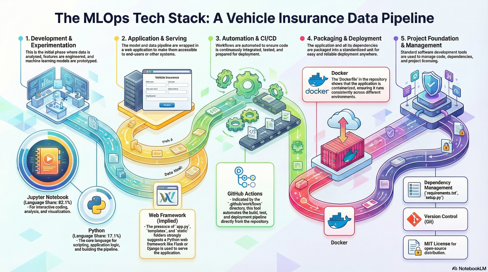
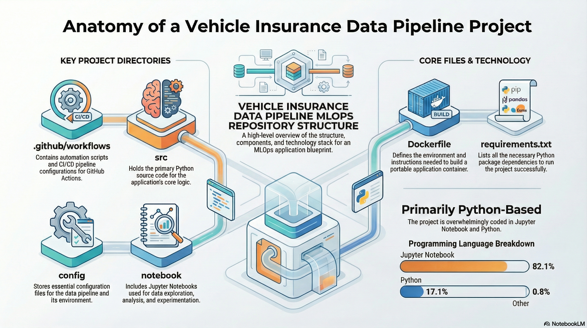

# Vehicle Insurance Data Pipeline (End-to-End MLOps)

[](LICENSE)
[](https://www.python.org/)
[](Dockerfile)
[](#-deployment-aws-ecr--ec2)
[](#-cicd-github-actions)

An end-to-end **MLOps project** that builds a production-ready pipeline for **vehicle insurance response prediction** — from data ingestion (MongoDB) to training/evaluation, model versioning (S3), and deployment (Docker + GitHub Actions + AWS EC2).

> Recruiter-friendly goal: if you skim only this README, you should still understand **what the project does**, **how it’s built**, and **how to run it**.

---

## 🔎 What’s inside (high level)

- **Modular pipeline**: ingestion → validation → transformation → training → evaluation → pusher  
- **Config-driven** with YAML schema checks
- **Artifact & model management** (local `artifact/` + cloud S3)
- **Production deployment** using **Docker**, **AWS ECR/EC2**, and **GitHub Actions**
- **Web app** for predictions + training trigger endpoint

---

## 📌 Table of Contents

- [Architecture](#-architecture)
- [Repo Structure](#-repo-structure)

- [Documentation Files](#-documentation-files)
- [Pipeline Stages](#-pipeline-stages)
- [Quickstart (Local)](#-quickstart-local)
- [Docker](#-docker)
- [CI/CD (GitHub Actions)](#-cicd-github-actions)
- [Deployment (AWS ECR + EC2)](#-deployment-aws-ecr--ec2)
- [Testing Utilities](#-testing-utilities)
- [Roadmap](#-roadmap)
- [Acknowledgements](#-acknowledgements)
- [License](#-license)

---

## 📚 Documentation Files

If you want the detailed build-notes / step-by-step project journey:

- `PROJECT_STRUCTURE.md` — full structure, stage-wise breakdown, and diagrams
- `project_flow.txt` / `workflow.txt` — detailed end-to-end setup checklist

## 🏗️ Architecture

### MLOps Tech Stack Overview



### Project Repository Structure



### Data + model flow

```mermaid
flowchart LR
    A[MongoDB Atlas<br/>Vehicle Insurance Data] --> B[Data Ingestion]
    B --> C[Data Validation<br/>schema.yaml]
    C --> D[Data Transformation<br/>preprocessing.pkl]
    D --> E[Model Trainer<br/>model.pkl]
    E --> F[Model Evaluation<br/>metrics/report]
    F -->|if improved| G[Model Pusher<br/>S3 / ECR-ready]
    G --> H[Prediction Service<br/>Web App / API]
````

### Why this design?

* **Separation of concerns**: each stage lives in its own component.
* **Reproducibility**: artifacts are saved per run, and the “best” model can be pulled from S3.
* **Deployability**: the same code runs locally, in Docker, and on EC2 via CI/CD.

---

## 🧰 Tech stack

* **Language**: Python (3.10+ recommended)
* **ML**: scikit-learn, pandas, NumPy (classic tabular ML pipeline)
* **Storage**: MongoDB Atlas (dataset), AWS S3 (model registry/artifacts)
* **Serving**: Python web app + HTML templates (see `templates/`, `static/`)
* **DevOps/MLOps**: Docker, GitHub Actions, AWS ECR, AWS EC2 (self-hosted runner)

---

## 📁 Repo Structure

### Root-level

* `app.py` — web application (prediction UI/API)
* `demo.py` — runs the training pipeline end-to-end
* `Dockerfile` / `.dockerignore` — containerization
* `requirements.txt` / `pyproject.toml` / `setup.py` — dependency & packaging setup
* `config/` — configuration files (e.g., schema)
* `notebook/` — EDA + data upload notebooks
* `templates/`, `static/` — UI assets
* `.github/workflows/` — CI/CD pipelines
* `src/test_utilities/` — quick scripts for infra sanity checks

### Source code (`src/`)

Typical layout:

```
src/
  components/          # pipeline steps (ingest, validate, transform, train, eval, push)
  pipeline/            # training + prediction pipelines orchestration
  configuration/       # MongoDB connection, settings
  data_access/         # data fetch/read layer
  cloud_storage/       # S3 model/artifact handling
  entity/              # config & artifact dataclasses
  utils/               # helpers (IO, metrics, schema checks, etc.)
  logger/              # logging setup
  exception/           # custom exception handling
```

---

## 🧩 Pipeline stages

1. **Data Ingestion**
   Pull data from **MongoDB**, create train/test splits, write artifacts.

2. **Data Validation**
   Validate columns/types against `config/schema.yaml`, basic integrity checks.

3. **Data Transformation**
   Feature engineering + preprocessing; save transformer (`preprocessing.pkl`).

4. **Model Training**
   Train a scikit-learn model; save model (`model.pkl`) + training metadata.

5. **Model Evaluation**
   Compare against “best model” (local or S3). Persist metrics and decision.

6. **Model Pusher**
   If performance improves, push model + artifacts to **AWS S3** as the new best version.

7. **Serving**
   The web app loads the latest model and provides:

   * prediction UI/API
   * optional `/training` route to trigger training

---

## � Model Performance

| Metric | Score |
|--------|-------|
| **F1 Score** | 91.8% |
| **Precision** | 86.3% |
| **Recall** | 98.3% |
| **Training Data** | 762,218 records |
| **Algorithm** | RandomForestClassifier |

---

## �🚀 Quickstart (Local)

### 1) Clone + install

```bash
git clone https://github.com/ShalinVachheta017/Vehicle-Insurance-DataPipeline-MLops-.git
cd Vehicle-Insurance-DataPipeline-MLops-

# Create env (conda example)
conda create -n VehiInsure python=3.10 -y
conda activate VehiInsure

pip install -r requirements.txt
```

### 2) Set environment variables

Create a `.env` file (or export vars in your terminal):

```bash
# MongoDB
MONGODB_URL="mongodb+srv://<user>:<password>@<cluster>/?retryWrites=true&w=majority"

# AWS (for S3 / ECR workflows)
AWS_ACCESS_KEY_ID="..."
AWS_SECRET_ACCESS_KEY="..."
AWS_DEFAULT_REGION="us-east-1"
```

> Tip: If you only want to run locally without S3, you can skip AWS vars (model will remain local).

### 3) Push / verify data in MongoDB (one-time)

Use the notebooks inside `notebook/` to upload the dataset to MongoDB Atlas.

### 4) Run training pipeline

```bash
python demo.py
```

Artifacts will be generated under `artifact/`.

### 5) Run the web app

```bash
python app.py
```

Open:

* Local: `http://localhost:5000`
* Docker/EC2: `http://<public-ip>:5000`

---

## 🐳 Docker

### Build

```bash
docker build -t vehicle-insurance-mlops:latest .
```

### Run

Run the container:

```bash
docker run --env-file .env -p 5000:5000 vehicle-insurance-mlops:latest
```

Then open: `http://localhost:5000`

---

## 🔁 CI/CD (GitHub Actions)

This repo includes CI/CD workflows that typically:

1. build a Docker image
2. authenticate to AWS
3. push the image to **ECR**
4. deploy/run on **EC2** (often via a self-hosted runner)

### Required GitHub Secrets (typical)

* `AWS_ACCESS_KEY_ID`
* `AWS_SECRET_ACCESS_KEY`
* `AWS_DEFAULT_REGION`
* `ECR_REPO` (ECR repository URI/name)

---

## ☁️ Deployment (AWS ECR + EC2)

High-level steps:

1. **Create AWS resources**

   * IAM user with permissions for ECR + EC2 + S3 (or scoped policies)
   * ECR repository (for Docker image)
   * S3 bucket (for model registry/artifacts)

2. **Prepare EC2**

   * install Docker
   * connect EC2 as **self-hosted GitHub Actions runner**
   * open inbound rule for port **5000** (Custom TCP, 0.0.0.0/0)

3. **Deploy**

   * push a commit → GitHub Actions builds & deploys
   * access app at: `http://<EC2_PUBLIC_IP>:5000`

---

## 🧪 Testing utilities

From `src/test_utilities/`:

```bash
python src/test_utilities/test_aws_connection.py
python src/test_utilities/check_s3_bucket.py
```

Use these to quickly verify AWS connectivity and bucket access.

---

## 🛣️ Roadmap

* Add **model monitoring** (drift + performance logging)
* Add **experiment tracking** (e.g., MLflow)
* Add **data/versioning** (e.g., DVC) and reproducible dataset snapshots
* Add **unit tests** for pipeline components + CI test job
* Add **structured model registry** versioning in S3 (tags/metadata)

---

## 🙏 Acknowledgements

Project structure and learning flow are inspired by Vikash Das’ YouTube MLOps series and reference implementation.

* Reference repo: `vikashishere/YT-MLops-Proj1`
* Playlist: “The Ultimate MLOPS Course”

---

## 📄 License

This project is licensed under the MIT License — see [LICENSE](LICENSE).